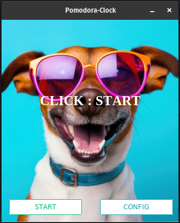

<!-- PROJECT LOGO -->
 

  

  <h3 align="center">Pomodora Clock</h3>

  

    A simple custimizable pomodoro clock!
     
    <a href="https://github.com/Ryan-Goosen/Pomodora-Clock"><strong>Explore the docs »</strong></a>
     
     
  

<!-- Shields -->

  [![Contributors][contributors-shield]][contributors-url] [![Forks][forks-shield]][forks-url] [![Stargazers][stars-shield]][stars-url] [![Issues][issues-shield]][issues-url] [![License][license-shield]][license-url]

<!-- [![LinkedIn][linkedin-shield]][linkedin-url] -->

<!-- TABLE OF CONTENTS -->

  
Table of Contents

  <ol>
    <li>
      <a href="#about-the-project">About The Project</a>
      <ul>
        <li><a href="#built-with">Built With</a></li>
      </ul>
    </li>
    <li>
      <a href="#getting-started">Getting Started</a>
      <ul>
        <li><a href="#prerequisites">Prerequisites</a></li>
        <li><a href="#installation">Installation</a></li>
      </ul>
    </li>
    <li><a href="#usage">Usage</a></li>
    <li><a href="#roadmap">Roadmap</a></li>
    <li><a href="#contributing">Contributing</a></li>
    <li><a href="#license">License</a></li>
    <li><a href="#contact">Contact</a></li>
    <li><a href="#acknowledgments">Acknowledgments</a></li>
  </ol>

<!-- ABOUT THE PROJECT -->
## About The Project

![Product Name Screen Shot][product-screenshot]

I created this Pomodora-Clock to help me start working by creating small time commitments which helped me overcome the mountain that is a 2 hours study session.

(<a href="#readme-top">back to top</a>)

### Built With

[![Python][Python]][Python]

(<a href="#readme-top">back to top</a>)

<!-- GETTING STARTED -->
## Getting Started

These instructions cover both the running of the packaged version and the raw code.

### Prerequisites
- Python
- ttkbootstrap
- pygame

### Running from code:
1. Open your terminal inside the folder
2. Running the program:

   2.1 `python3 main.py` on **Linux Machines**

   2.2 `python main.py` on **Windows Machines** 

### Packaging the code

(<a href="#readme-top">back to top</a>)

<!-- USAGE EXAMPLES -->
## Usage
1. Timer tracker
2. Pomodoro Clock
3. Stopwatch

<!-- CONTRIBUTING -->
## Contributing

Not needed.

### Top contributors:

(<a href="#readme-top">back to top</a>)

<!-- LICENSE -->
## License

Distributed under the Unlicense License. See `LICENSE` for more information.

(<a href="#readme-top">back to top</a>)

<!-- ACKNOWLEDGMENTS -->
## Acknowledgments

Use this space to list resources you find helpful and would like to give credit to. I've included a few of my favorites to kick things off!

* [rawpixel.com Cool Dog Image](https://www.rawpixel.com/image/12053935/image-background-dog-face)
* [othneildrew Best-README-Template](https://github.com/othneildrew/Best-README-Template)

(<a href="#readme-top">back to top</a>)

<!-- MARKDOWN LINKS & IMAGES -->
<!-- https://www.markdownguide.org/basic-syntax/#reference-style-links -->
[contributors-shield]: https://img.shields.io/github/contributors/Ryan-Goosen/Pomodora-Clock.svg?style=for-the-badge
[contributors-url]: https://github.com/Ryan-Goosen/Pomodora-Clock/graphs/contributors
[forks-shield]: https://img.shields.io/github/forks/Ryan-Goosen/Pomodora-Clock.svg?style=for-the-badge
[forks-url]: https://github.com/Ryan-Goosen/Pomodora-Clock/network/members
[stars-shield]: https://img.shields.io/github/stars/Ryan-Goosen/Pomodora-Clock.svg?style=for-the-badge
[stars-url]: https://github.com/Ryan-Goosen/Pomodora-Clock/stargazers
[issues-shield]: https://img.shields.io/github/issues/Ryan-Goosen/Pomodora-Clock.svg?style=for-the-badge
[issues-url]: https://github.com/Ryan-Goosen/Pomodora-Clock/issues
[license-shield]: https://img.shields.io/github/license/Ryan-Goosen/Pomodora-Clock.svg?style=for-the-badge
[license-url]: https://github.com/Ryan-Goosen/Pomodora-Clock/blob/main/LICENSE
<!-- [linkedin-shield]: https://img.shields.io/badge/-LinkedIn-black.svg?style=for-the-badge&logo=linkedin&colorB=555
[linkedin-url]: https://linkedin.com/in/othneildrew -->
[product-screenshot]: images/final.png
[Python]: https://img.shields.io/badge/python-3670A0?style=for-the-badge&logo=python&logoColor=ffdd54
